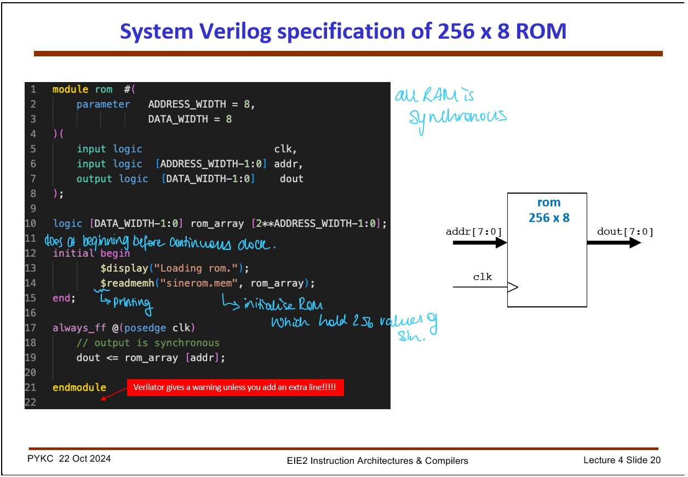
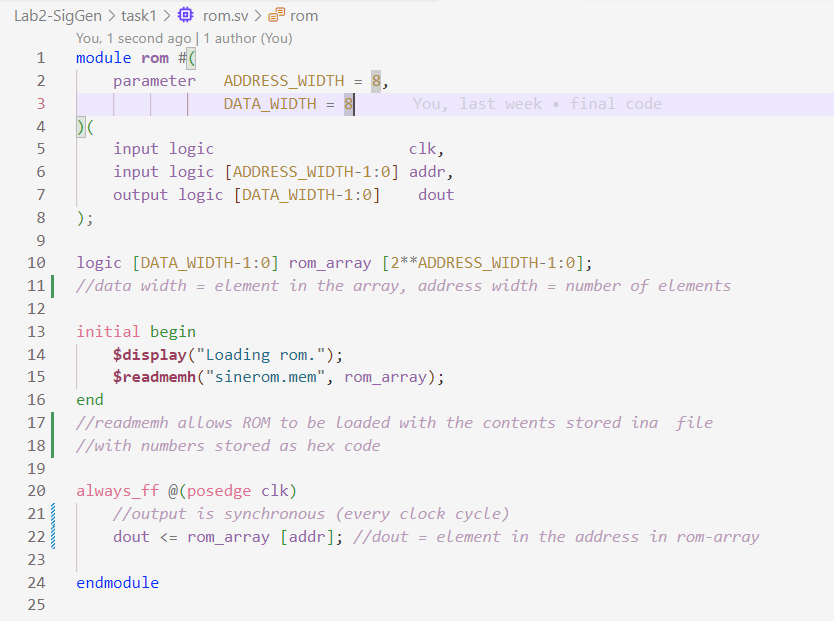
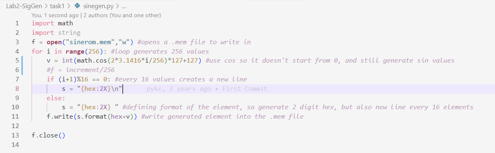
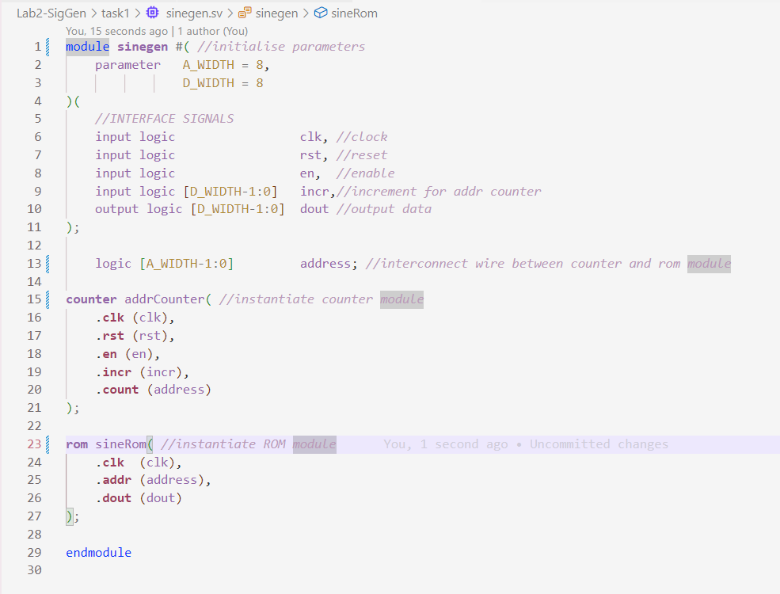
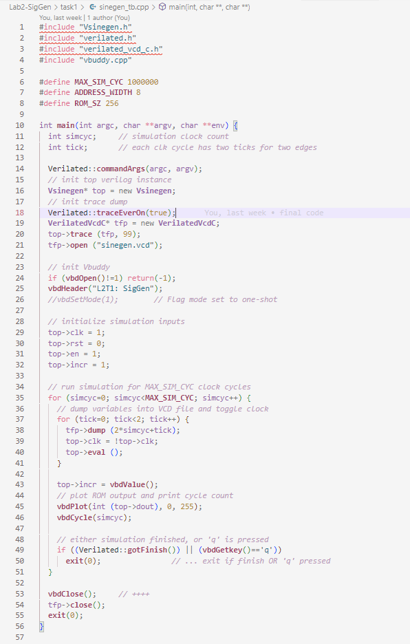
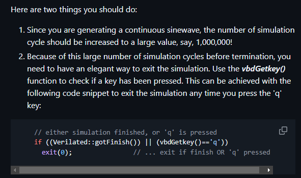
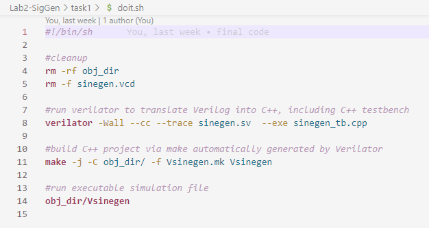

## Task 1: Simple sinewave generator

# Step 1: Specifying a 256 x 8 bit ROM

Here instead of physical implementation, we specify them behaviourally.
 - allows digital system to be modelled, simulated, verified
 - While counters, shift registers and other types of circuits are synthesised to produce transistors and gates, memories are mapped to pre-designed blocks
  - e.g. Memory in FPGAs are usually explicitly instantiated as embedded RAM
    - synthesised memory cells are synthesised into D-FF
    - large and expensive resources

In the code above:
 - we define the parameters
  - when we insantiate the module in code [rom sineRom(clk, 10, 12)], the ADDRESS_WIDTH and DATA_WIDTH would get overwritten with new values 10 and 12 respectively. - This allows reusablity of modules (as opposed to using 8 and 8 throughout the code).
 - (logic) used to define a binary signal (logic signal) which is a signal type (rather than datatype like int)

The readmemh function allows the ROM to be loaded with contents stored in the file *sinerom.mem*.

This means the ROM is now filled with the hexdecimal numbers from that file.

We generate the code using *sinegen.py*:

Essentially, the python script generates values which plots a cosine function. Each value is stored in sinerom.mem. The values are stored in rom.sv using the readmemh function

# Step 2: Creating a sinegen module!
[alt text](image-6.png)

This works by:
 - the interface signals work the same way for the og counter module. 
  - Difference is we add an increment input
  - this determines the frequency of the wave
  - before it incremented by 1, now it increments by the amount we specify in the increment input
 - output is the address input in ROM
  - able to look through the ROM addresses using the counter
  - ROM now contains coorindates for a sinusoid, the *dout* of ROM helps plot the sine wave

The increment works by:
 - the counter produces the address of the ROM, and the output of the (cos)sine values
 - frequency is determined by *incr[7:0]*
 - if we have a higher increment, we go through the ROM addresses in a fewer number of cycles

In general the output sine wave is:
$$ f_out = f_clk * \frac{incr}{256} $$

# Step 3: Create a testbench for the sinegen

The *vbdGetKey()* is non blocking
 - it returns immediately with a NULL character if no key is pressed
 - otherwise it returns the ASCII code of the key being pressed

# Step 4: Modify Doit.sh file

# Challenge: Modify design to use vbdValue() to change frequency of the sinewave generated

come back and fill in the gaps