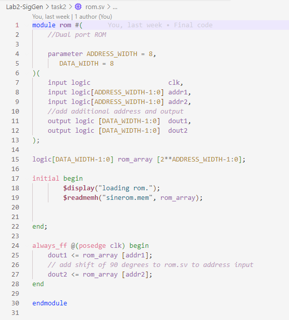
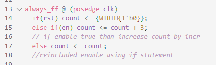
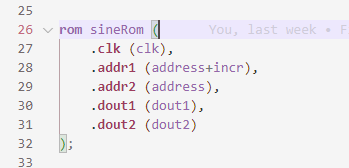

## Task 2: Sine and Cosine Dul wave generation

Here, I had to modify the design from task 1 to generate 2 simultaneous sinusoid signals with different phases.

The phase offset between the 2 sin waves is determined by the rotary encoder on Vbuddy.

I had to use a *dual port ROM*, with the first port's address being *addr[7:0]* from the counter, and the second port's address being *addr2[7:0]* being offset from first address.
This offset is read from the Vbuddy with teh *vbdValue()* function.

First I created a new structure using a dual-port ROM:
.

I changed the counter to increment using a constant rather than an incr parameter. This is because the *incr* is used to offset the address, and changing the frequency whilst offsetting the address would make it difficult to view the phase difference.

setting increment to 3 just produces a nice waveform to view.

I then changed the *sinegen module* so that *addr1* is offsett by *incr*. The *top->incr = vbdValue()* in the testbench means the *addr1* is offsetted by the *vbdValue()*.

This outputted 2 sine waves, which were 90 degrees apart in phase when the offset value was 64.

These signals are called *quadrature signals*, often used in communication systems.